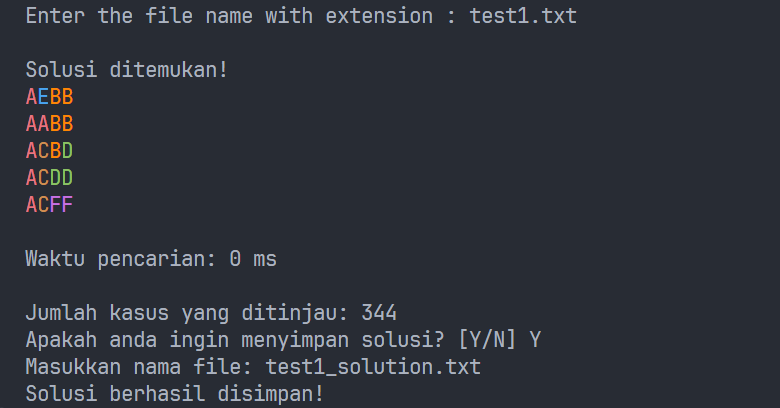
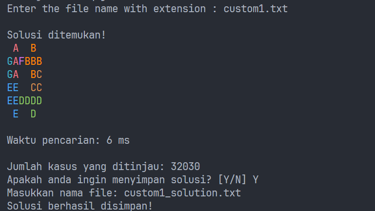
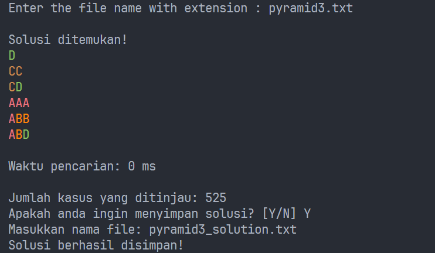

# IQ Puzzler Pro Solver
An IQ Puzzler Pro variant brute force solver. The program can solve for puzzles of variable rectangular board dimension and blocks. The solver attempts to place each block in various orientation in every position on the board with backtracking. Found solution can be written into a txt file.  
  
Program screen capture:  
  
  
  
  
  
## Requirements
A java runtime is required to run the program (tested on Java 23). The compiled program is already provided. Apache Ant can be used to rebuild the program with the following command
```
ant package
```
## How to run
Provide the puzzle in a txt file in the `input` directory with the format below. `N` and `M` denote the dimension of the NxM board. `P` is the number of blocks in the puzzle. `S` is the puzzle mode with the valid value of either `DEFAULT`, `CUSTOM` or `PYRAMID `. Examples are available in the `input` directory. 
```
N M P
S
puzzle_1_shape
puzzle_2_shape
...
puzzle_P_shape
```
The program is then run by the following command
```
java -jar bin/iq.jar
```
Enter the name of the txt file of the puzzle to solve. Solutions are saved in the `output` directory
## 
Syahrizal Bani Khairan 13523063  
Tugas Kecil 1 IF2211 Strategi Algoritma
